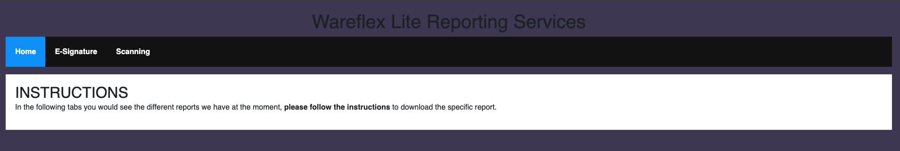
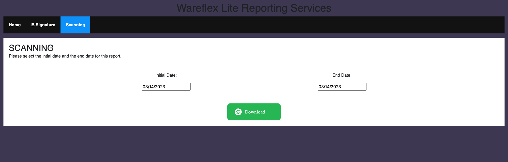

# Wareflex Lite Reports

Set of automatic reports and downloads for Wareflex Lite for the analysis and improvement of warehouses, avoiding a long wait for this reports.

## WFReportAPI Reference

#### Get all E-Signature Report

```http
  GET /esignature?startDate=${startDate}endDate=${endDate}
```

| Parameter   | Type     | Description                                               |
| :---------- | :------- | :-------------------------------------------------------- |
| `startDate` | `string` | **Always starts with Today date**. Initial date to search |
| `endDate`   | `string` | **Always starts with Today date**. Final date to search   |

#### Get Scanning Report

```http
  GET /scanning?startDate=${startDate}endDate=${endDate}
```

| Parameter   | Type     | Description                                               |
| :---------- | :------- | :-------------------------------------------------------- |
| `startDate` | `string` | **Always starts with Today date**. Initial date to search |
| `endDate`   | `string` | **Always starts with Today date**. Final date to search   |

## Screenshots

]

]

]

## Installation

Install WFReportApi with python

- Go to project folder
  ```bash
  cd WFReportApi
  ```
- Active enviroment
  ```bash
  source ./env/lib/activate
  ```
- Try

  ```bash
  python main.py
  ```

  If not success install:

  - Python FastApi
    ```bash
    pip install fastapi==0.78.0
    ```
  - Uvicorn
    ```bash
    pip install uvicorn==0.17.6
    ```
  - Decouple
    ```bash
    pip install python-decouple
    ```
  - MySQL Connector
    ```bash
    pip install mysql-connector-python
    ```

Install wfreports with npm

- Go to project folder
  ```bash
  cd wfreports
  ```
- Then install
  ```bash
  npm install
  ```

## Environment Variables

To run this project, you will need to add the following environment variables to your .env file on WFReportApi

`DB_HOST`
`DB_USERNAME`
`DB_PASSWORD`
`DB_NAME`
`QUERY_ESIGNATURE`
`QUERY_SCANNING`

## Deployment

To deploy WFReportApi run

```bash
  python main.py
```

To deploy wfreports run

```bash
  npm start
```
